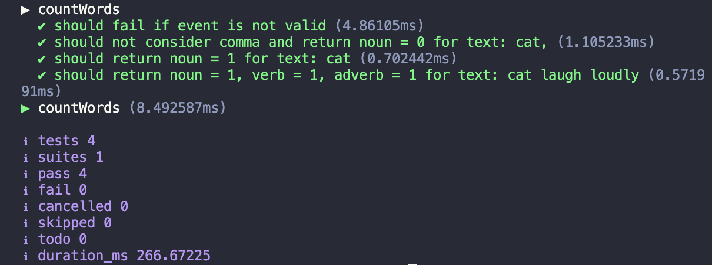

# Run locally

Requirements
- Nodejs v18.x installed
- Serverless framework ^3.52 installed


```bash
> sls invoke local -f count-words --path ./src/lambdas/count-words/count-words.event.json
```

Which should result in response similar to the following:

```json
{
    "statusCode": 200,
    "body": "{\"noun\":1,\"verb\":1,\"adjective\":0,\"adverb\":0,\"preposition\":0,\"conjunction\":0,\"pronoun\":0,\"interjection\":0,\"determiner\":0,\"numeral\":0}"
}
```

# How to run tests

```bash
> npm test
```

Covers lambda unit testing

## Test results



# Deployment

Requirements
- AWS credentials configured
- Serverless framework ^3.52 installed

```bash
> sls deploy
```

Will automatically deploy to dev stage
